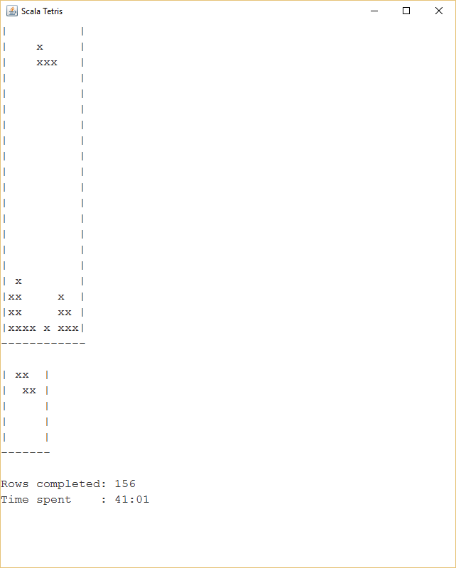

# Scala Tetris

A really simple Tetris implementation in about 600 lines of Scala code.

## Build
`sbt run` should do the trick.

## Gameplay
There are two modes: Running and pause

Controls in running mode, the game starts in this mode:

1. W - Move stone left
2. D - Move stone right
3. S - Move stone down
4. Q - Rotate stone left
5. E - Rotate stone right
6. P - Pause game

Controls in pause mode, the game enters this mode if 'P' is pressed or the game is over:

1. W - Move backward in time
2. D - Move back into the future
3. R - Start a new game
4. C - Continue the game from the current position in time

Have fun!